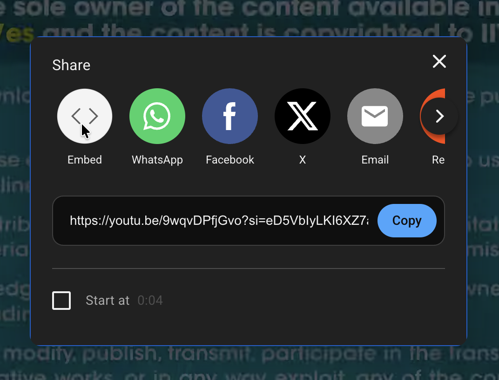
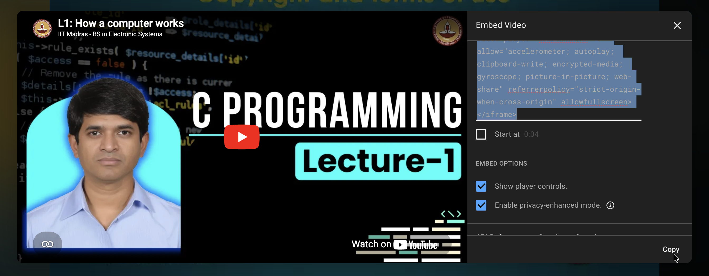
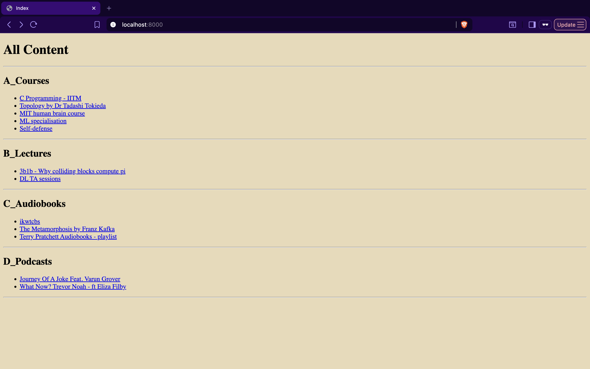
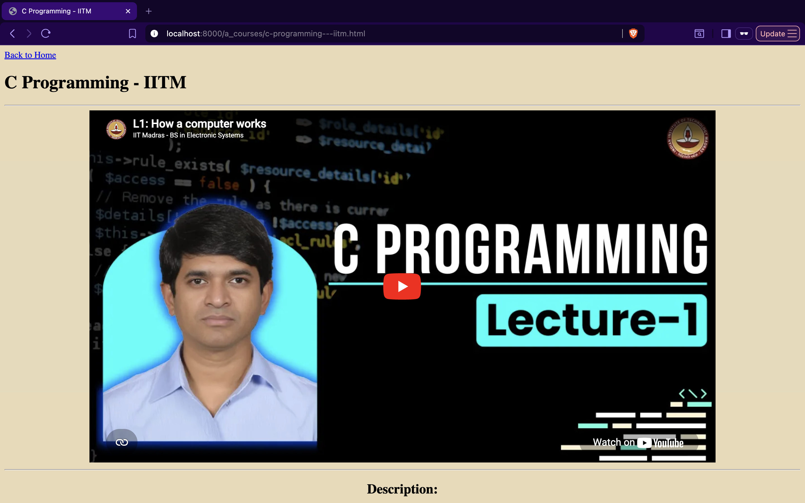
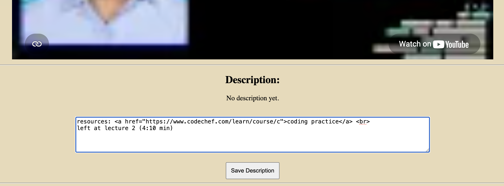
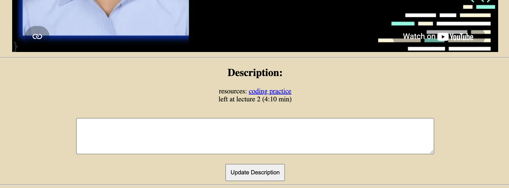
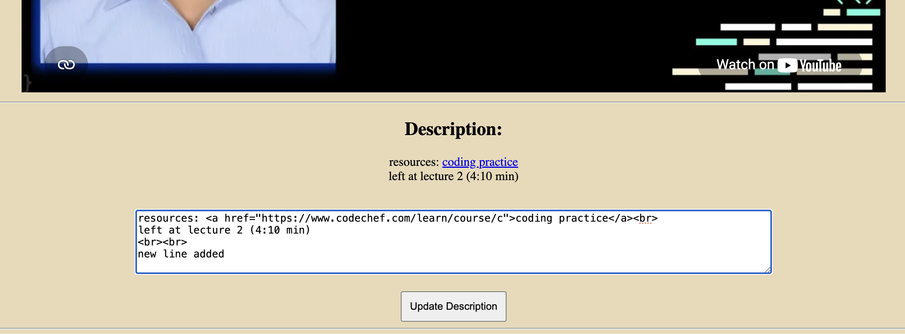
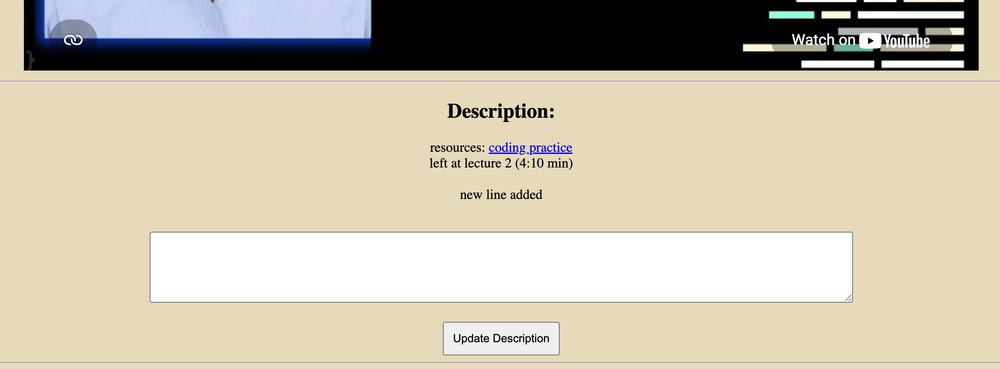

# Minimal Interface for Autonomous Access to Social Media (MIAASM)

- **Minimal Interface**: simple design to reduce distractions; made with **online learning** in mind. 
- **Autonomous Access**: You plan and filter what content you want to watch — like important YouTube videos, playlists, or Instagram posts—so you stay in control — like bringing groceries home instead of living in the supermarket!

## How to use it?

- Open Terminal (on Mac/Linux) or Command Prompt (on Windows)
- Clone: `git clone git@github.com:Schefflera-Arboricola/miaasm.git`
- Change directory: `cd miaasm`
- Install necessary libraries: `pip install -r requirements.txt`
- Add content and customize interface
    - You can organise your content under various categories corresponding to differnt `.yaml` files. Each entry in a `.yaml` file corresponds to a content (video, playlist, post, etc.). Look at the example `.yaml` files in the [`content`](./content) folder.
        - Adding content in `.yaml` files: Add a title (`name`), `description` (optional), and an embed link (`iframe`):
            - On YouTube/Instagram, click `Share` > `Embed`
              
            - Copy the code and paste the link into the `iframe` field in the `.yaml` file
              
        
        Note: Youtube still recommends videos in embedded form-- pair it with [the "why" pop-up extension](https://github.com/Schefflera-Arboricola/the-why-pop-up) for better experience.
        
        - `description` - if you want some text to appear under your content on the webpage.
    - [optional] Update [`app.py`](app.py): you can edit `SCALE` to modify the size of the embedded content, and `BG_COLOR` to change the background color (use https://encycolorpedia.com/ to get the hexadecimal color code) of the website.
- Launch your site: `python3 app.py`. Then open `http://127.0.0.1:5000` in your browser
- Press `Ctrl+C` in Terminal to stop hosting

## Features and Functionalities

- index page - See all your saved content at a glance. Each section corresponds to a `.yaml` file, and the lists under those sections is the list of content in those yaml files
  

- content page -
    - the url is of the format: `<yaml file name>/<"name" specified for this content entry in the yaml file>.html`

    

- Add/update `description` text directly in the `.yaml` file or from the webpage-- changes save back to the `.yaml` file.
    - adding a descripiton:
        
        - click `Save Description`. Note, you can use html in the text box.
          
    - updating the description:
        
        - click `Update Description`
        

    Note, once the new description is added or updated, the old description will be lost permanently.

Thank you :)
